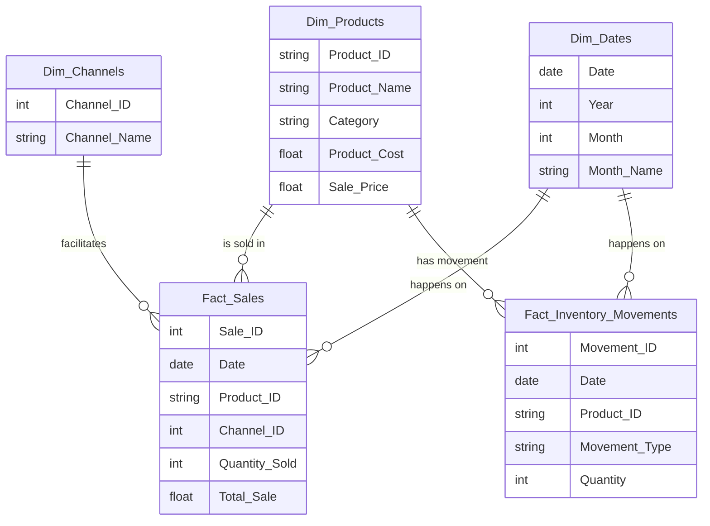

# E-commerce Inventory & Sales Synthetic Data Generator

[English](#english) | [Español](#español)

---

<a name="english"></a>
## 🇬🇧 English Description

This project contains a Python script (`generate_data.py`) that generates synthetic data for an E-commerce business. The data is structured in a **Star Schema** ideal for PowerBI or Data Warehousing projects.

### Features
-   **Multi-Language Support**: Generates two separate datasets:
    -   `output/en_EN/`: Data in English (e.g., "Laptop", "January").
    -   `output/es_ES/`: Data in Spanish (e.g., "Portátil", "Enero").
-   **Consistent Schema**: Both datasets use **identical filenames and column headers** (in Spanish, e.g., `ID_Producto`, `Fecha`). This allows you to switch the data source in PowerBI between English and Spanish simply by changing the folder path, without breaking any relationships or measures.
-   **Realistic Logic**:
    -   Product names match their categories.
    -   Inventory movements track stock levels (Sales decrease stock, Purchases increase stock).
    -   No negative stock values.

## 📊 Visuals & Schema

### Galaxy Schema
The data follows a **Galaxy Schema** (Fact Constellation), where multiple Fact tables share Dimension tables.

<div align="center">
  
  <p><em>Galaxy Schema Representation</em></p>
</div>



### PowerBI Dashboard
Example of the dashboard connected to the generated data.

<div align="center">
  
</div>

### Generated Tables
1.  **dim_products.csv** (`Dim_Productos`): Product catalog with costs and prices.
2.  **dim_channels.csv** (`Dim_Canales`): Sales channels (Shopify, Amazon, etc.).
3.  **dim_dates.csv** (`Dim_Fechas`): Calendar table.
4.  **fact_sales.csv** (`Fact_Ventas`): Transactional sales data.
5.  **fact_inventory_movements.csv** (`Fact_Movimientos`): History of stock changes.

### Usage
1.  Ensure you have Python installed with `pandas` and `faker`.
    ```bash
    pip install pandas faker
    ```
2.  Run the script:
    ```bash
    python generate_data.py
    ```
3.  The data will be generated in the `output/` folder.

---

<a name="español"></a>
## 🇪🇸 Descripción en Español

Este proyecto contiene un script de Python (`generate_data.py`) que genera datos sintéticos para un E-commerce. Los datos están estructurados en un **Esquema de Estrella**, ideal para proyectos de PowerBI o Data Warehousing.

### Características
-   **Soporte Multi-Idioma**: Genera dos conjuntos de datos separados:
    -   `output/en_EN/`: Datos en Inglés.
    -   `output/es_ES/`: Datos en Español.
-   **Esquema Consistente**: Ambos conjuntos de datos utilizan **los mismos nombres de archivo y encabezados de columna** (en Español, ej. `ID_Producto`, `Fecha`). Esto permite cambiar la fuente de datos en PowerBI entre Inglés y Español simplemente cambiando la ruta de la carpeta, sin romper relaciones ni medidas.
-   **Lógica Realista**:
    -   Los nombres de los productos coinciden con sus categorías.
    -   Los movimientos de inventario rastrean los niveles de stock (Las ventas disminuyen el stock, las compras lo aumentan).
    -   Sin valores de stock negativos.

### Tablas Generadas
1.  **dim_products.csv** (`Dim_Productos`): Catálogo de productos con costos y precios.
2.  **dim_channels.csv** (`Dim_Canales`): Canales de venta (Shopify, MercadoLibre, etc.).
3.  **dim_dates.csv** (`Dim_Fechas`): Tabla calendario.
4.  **fact_sales.csv** (`Fact_Ventas`): Datos transaccionales de ventas.
5.  **fact_inventory_movements.csv** (`Fact_Movimientos`): Historial de cambios de stock.

### Uso
1.  Asegúrate de tener Python instalado con `pandas` y `faker`.
    ```bash
    pip install pandas faker
    ```
2.  Ejecuta el script:
    ```bash
    python generate_data.py
    ```
3.  Los datos se generarán en la carpeta `output/`.
